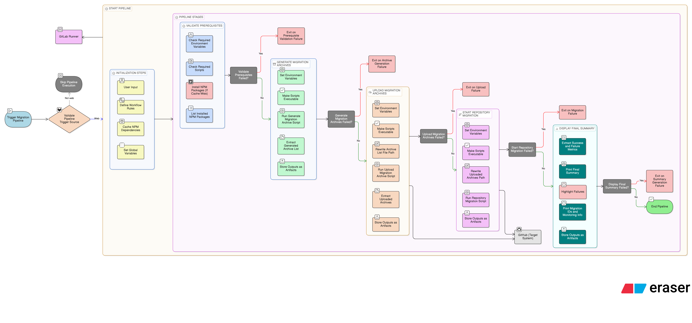

# GitLab → GitHub Migration


## 1. Executive Summary – Objective
This document provides detailed procedures to migrate source code repositories from **GitLab Server** to **GitHub**.

## 2. Requirements

### 2.1 GitLab Runner Host Requirements
- **OS:** Ubuntu
- **Docker:** latest stable
- **Node.js:** v20+
- **npm:** v10+
- **Docker image:** `gl-exporter`

### 2.2 Access Requirements
- **Password-less sudo** configured for the user running the **GitLab Runner** process
- **GitLab access** to:
  - View migration scripts stored in the project
  - Trigger the pipeline
  - Monitor the migration pipeline

### 2.3 Required Token Scopes

#### GitLab API Token
- Must be generated using an **admin user**
- Required permissions: **full API access**
- Used by `gl-exporter` during archive generation

#### GitHub Personal Access Token (PAT)
Required scopes:
- `repo`
- `admin:org`
- `workflow`
- `user`

### 2.4 Enable GitHub Object Storage Feature Flag
- GitHub object storage feature flag must be enabled both for GitHub handle and GitHub organizations. Raise a request with GitHub Support to enable this feature.

### 2.5 Intermediate Storage for Archive Files
- GitHub Storage (up to 30 GB)
- Azure / AWS Storage (up to 40 GB)
- **GitHub Cloud with Data Residency requires Azure or AWS storage**

### 2.6 Install GH CLI
- Install GitHub CLI by following the link below
```
https://github.com/cli/cli#installation
```

### 2.7 Install GH CLI extensions
- Install gh-gitlab-stats CLI extension by running below command. This extension is required for generating inventory reports.
```
gh extension install https://github.com/mona-actions/gh-gitlab-stats
```
- Install gh-migration-monitor CLI extension by running below command. This extension is required to monitor the status of migrations.
```
gh extension install https://github.com/mona-actions/gh-migration-monitor
```
- Install the gh-ado2gh CLI extension. This extension is required to generate mannequins (user identity mapping) CSV files, reclaim mannequins, and wait for/check the migration status.
```
gh extension install https://github.com/github/gh-ado2gh
```

### 2.8 Network configuration
- The customer is required to configure the allow IP lists according to their implementation. The following documentation will assist with configuration if it has not yet been completed.
```
https://docs.github.com/en/enterprise-cloud@latest/migrations/ado/managing-access-for-a-migration-from-azure-devops#configuring-ip-allow-lists-for-migrations
```

## 3. Repository Contents
    .
    ├── .gitlab-ci.yml
    ├── README.md
    ├── docs/
    │   ├── images/
    │   │   └── GitLab_to_GitHub_Migration_-_CI_Pipeline_Workflow.png
    │   └── diagrams/
    │       └── GitLab_to_GitHub_Migration_-_CI_Pipeline_Workflow.txt
    ├── config.sh
    ├── runner.sh
    ├── gl-migration-readiness-check.sh
    ├── generate-gl-migration-archive.sh
    ├── upload-gl-migration-archive.sh
    ├── start-gl2gh-repo-migration.sh
    ├── gl-post-migration-validation.sh
    ├── gitlab-stats-sample.csv
    └── migration_scripts/
        ├── batch.js
        ├── create-env-vars.js
        ├── create-migration-source.js
        ├── gh-api.js
        ├── index.js
        ├── issue.js
        ├── migration.js
        ├── package.json
        ├── repository.js
        ├── start-repo-migration.js
        ├── state.js
        ├── team.js
        ├── upload-to-github-blob.sh
        ├── upload-to-azure-blob.sh
        ├── upload-to-aws-blob.sh
        ├── user.js
        └── workflow.js

## 4. Scripts and Purpose

### 4.1 Shell scripts
| Script | Purpose |
|------|---------|
| `config.sh` | Contains shared / generic variables used by multiple scripts. |
| `runner.sh` | Runner helper / wrapper script (used to execute the workflow in the runner environment). |
| `gl-migration-readiness-check.sh` | Check for active merge requests and running pipelines. |
| `generate-gl-migration-archive.sh` | Generates GitLab migration archives (exports) for repositories defined in the inventory. |
| `upload-gl-migration-archive.sh` | Uploads the generated archives to GitHub storage (used later by migration jobs). |
| `start-gl2gh-repo-migration.sh` | Triggers repository migrations in GitHub. |
| `gl-post-migration-validation.sh` | Compares branch and commit counts between GitLab and GitHub to validate migration. This script is not part of the CI/CD pipeline and must be run manually after migration completes. |

### 4.2 Scripts in `migration_scripts/` directory
This directory contains JavaScript modules used to orchestrate GitHub migration operations.

| List of JS scripts |
|------|
| `batch.js` |
| `create-env-vars.js` |
| `create-migration-source.js` |
| `gh-api.js` |
| `index.js` |
| `issue.js` |
| `migration.js` |
| `repository.js` |
| `start-repo-migration.js` |
| `state.js` |
| `team.js` |
| `user.js` |
| `workflow.js` |
| `upload-to-github-blob.sh` |
| `upload-to-azure-blob.sh` |
| `upload-to-aws-blob.sh` |

## 5. Pre-Migration

### 5.1 Build gl-exporter Docker Image
- Copy gl_exporter folder to the server where the migration commands will be executed.
- Build the `gl-exporter` Docker image using running `docker build` command
```bash
cd gl_exporter
sudo docker build --no-cache=true -t gl-exporter .
```
- Verify the image creation using the `docker images` command.

**Example output:**

```bash
root@GLMigration:/opt/migration2ghscripts_new# docker images
REPOSITORY    TAG       IMAGE ID       CREATED        SIZE
gl-exporter   latest    5e168437a7a1   12 hours ago   1.51GB
ruby          3.2.1     3440a912810a   2 years ago    893MB
```

The inventory file defines the scope of GitLab repositories to be migrated and their target mappings in GitHub.

### 5.2 Generate inventory CSV
Before triggering the pipeline, generate an inventory file using the GitHub CLI extension `gitlab-stats`:

```bash
gh gitlab-stats --hostname "$SOURCE_GL_SERVER_URL" --token "$GITLAB_API_PRIVATE_TOKEN" --namespace <gitlab-group>
```

This produces a CSV inventory of repositories.

### 5.3 Edit inventory CSV
After generation, edit the CSV and add two columns:
- `github_org`
- `github_repo`

Fill in the target GitHub organization and repository name for each row.

#### Example Inventory CSV

| Namespace | Project | Commit_Count | Branch_Count | Full_URL | github_org | github_repo |
| -------- | -------- | -------- | -------- | -------- | -------- | -------- |
| demo-group/sub-group | demo-project | 20 | 1 | http://gitlab-server/demo-group/sub-group/demo-project | kcghorg | demoproject |
| demo-group-1/sub-group-1 | demo-project-1 | 20 | 1 | http://gitlab-server/demo-group/sub-group/demo-project-1 | kcghorg | demoproject1 |

**Notes**
- The example shows only the minimum required columns.
- The actual inventory CSV may contain additional metadata columns generated by `gh gitlab-stats`.
- Columns `github_org` and `github_repo` must be populated before running the pipeline.
- Upload the CSV to the GitLab project.
- This file name will be passed as the `INVENTORY_FILE` user input when running the pipeline.

### 5.4 Upload inventory to GitLab project
Upload the updated CSV into the GitLab project (so the pipeline can access it).

## 6. CI/CD Variable Setup (GitLab)
Configure CI/CD variables in:
**GitLab Project → Settings → CI/CD → Variables**

### For GitHub Enterprise Cloud
| Key | Example value | Description | Visibility |
|--------|-------------|--------|-------------|
| `SOURCE_GL_SERVER_URL` | `https://gitlab.company.com` | GitLab Server URL | Visible |
| `GITLAB_USERNAME` | `gitlab-user` | GitLab username | Visible |
| `GITLAB_API_PRIVATE_TOKEN` | `glpat-xxxxxxx` | GitLab API private token | Masked and hidden |
| `GH_PAT` | `ghp_xxxxx` | GitHub Personal Access Token | Masked and hidden |
| `GH_ORG` | `myghorg` | GitHub Organization name | Visible |


### For GitHub Enterprise Cloud with Data Residency
| Key | Example value | Description | Visibility |
|--------|-------------|--------|-------------|
| `SOURCE_GL_SERVER_URL` | `https://gitlab.company.com` | GitLab Server URL | Visible |
| `GITLAB_USERNAME` | `gitlab-user` | GitLab username | Visible |
| `GITLAB_API_PRIVATE_TOKEN` | `glpat-xxxxxxx` | GitLab API private token | Masked and hidden |
| `GH_PAT` | `ghp_xxxxx` | GitHub Personal Access Token | Masked and hidden |
| `GH_ORG` | `myghorg` | GitHub Organization name | Visible |
| `GH_SERVER_URL` | `https://SUBDOMAIN.ghe.com` | GitHub URL | Visible |
| `GH_API_URL` | `https://api.SUBDOMAIN.ghe.com` | GitHub API URL | Visible |
| `STORAGE_TYPE` | `AZURE (or) AWS` | Intermediate storage type | Visible |

- If storage type is Azure, export the following env
| Key | Example value | Description | Visibility |
|--------|-------------|--------|-------------|
| `AZ_CONTAINER` | `container-name` | Azure container name | Visible |
| `AZURE_STORAGE_CONNECTION_STRING` | `connection-string` | Connection String | Masked and hidden |

- If storage type is AWS, export the following env
| Key | Example value | Description | Visibility |
|--------|-------------|--------|-------------|
| `AWS_BUCKET_NAME` | `aws-bucket` | AWS Bucket name  | Visible |
| `AWS_REGION` | `us-west` | AWS region | Visible |
| `AWS_SECRET_ACCESS_KEY` | `aws-key` | AWS secret access keyx | Masked and hidden |
| `AWS_ACCESS_KEY_ID` | `access-id` | AWS access key ID | Masked and hidden |

## 7. Pipeline Flow
1. Validate CI/CD inputs, configuration, and prerequisites
2. Run readiness check to check active merge requests and running pipelines
3. Pause for manual approval (review readiness output before proceeding)
4. Generate GitLab repository migration archives
5. Upload migration archives to intermediate storage
6. Initiate GitHub repository migrations using uploaded archives
7. Display final migration summary (successes, failures, and migration IDs)
8. Preserve logs, reports, and outputs as pipeline artifacts



**Figure 1:** GitLab → GitHub migration pipeline showing validation, artifact staging, migration execution, and summary reporting.

### 7.1 Runner Tag Configuration
- This pipeline uses the GitLab Runner tag **`GLMigration`** to select the appropriate runner for execution.
- The runner tag **must be updated to match the GitLab Runner configured in your environment**.

#### Example
If your GitLab Runner is registered with the tag:
- `gitlab-runner-dev`

Then update the `tags:` section in `.gitlab-ci.yml` to match the runner tag for that environment.

```yaml
  tags: ["gitlab-runner-dev"]
```

### 7.2 Pipeline Trigger
The pipeline is **manually triggered** from GitLab Web UI and controlled using `workflow: rules`.

### 7.3 Executing the Pipeline
1. Open the GitLab project
2. Navigate to **Build → Pipelines**
3. Select **New Pipeline**
4. Provide the inventory filename as a variable:
   - Input: `INVENTORY_FILE`
   - Value: `<your-inventory-file>.csv`

   - Input: `GITHUB_TYPE`
   - Value: `GitHub (or) GitHubDR`

5. Select **New Pipeline** to start

### 7.4 Artifacts and Retention
The pipeline uploads artifacts (retained for **7 days**) to support troubleshooting, including:
- Output files
- Migration logs

## 8. Monitor the status of migration
- After executing migrations, it’s critical to monitor the progress and validate completion for each repository. This section outlines how to check migration status using the GitHub CLI and how to install and run a monitoring tool for real-time visibility.

### 8.1 Check Migration Status by Migration ID
- For GitHub Enterprise Cloud without Data Residency:
```
gh ado2gh wait-for-migration --migration-id <migration-id>
```

- GitHub Enterprise Cloud with Data Residency:
```
gh ado2gh wait-for-migration --migration-id <migration-id> --target-api-url "$GH_API_URL"
```

### 8.2 Monitor migrations with GitHub Extension (gh-migration-monitor)
- For GitHub Enterprise Cloud with Data Residency:
```
gh migration-monitor --organization $GH_ORG --github-token $GH_PAT
```

- GitHub Enterprise Cloud with Data Residency:
```
Migration-monitor extension is not supported in GitHub Cloud with Data Residency.
```

## 9. Post Migration Validation
- Run the below steps to perform migration validation

```bash
export INVENTORY_FILE="<your-inventory-file>.csv"
export GH_TOKEN="<github_pat>"
./gl-post-migration-validation.sh
```

- This script validates migration accuracy by comparing branch counts, commit counts, and repository metadata between GitLab and the corresponding GitHub repositories using the GitHub API.


## 10. User Identity Mapping (Mannequins)

### 10.1 Generate mannequins

#### For GitHub Enterprise Cloud without Data Residency:

- Generate Mannequin CSV for Organization:
```
gh ado2gh generate-mannequin-csv --github-org "{github-org}"
```

#### For GitHub Enterprise Cloud with Data Residency:
- Generate Mannequin CSV for Organization:
```
gh ado2gh generate-mannequin-csv --github-org "{github-org}" --target-api-url https://api.SUBDOMAIN.ghe.com
```

### 10.2 Update Mannequin Mapping
- Open `mannequins.csv`
- Populate the **Target User** column with valid GitHub usernames


#### Mannequins User Mapping Example

The following table shows an example of a **Mannequins CSV** used for user identity mapping after migration.  
Each GitLab user (represented as a mannequin in GitHub) is mapped to the corresponding GitHub user.

| mannequin-user | mannequin-id      | target-user   |
|----------------|-------------------|---------------|
| gluser1        | M_kgDODtfbRA      | github-user1  |
| gluser2        | M_kgDODtfbRg      | github-user2  |

**Explanation:**
- During migration, unmapped GitLab users are imported into GitHub as **mannequins**.
- The `target-user` column is updated with the correct GitHub username.
- This mapping is later used to reclaim mannequins and correctly associate commits, issues, and comments with real GitHub users.

### 10.3 Reclaim Mannequins

#### For GitHub Enterprise Cloud without Data Residency:

- Reclaims mannequins by mapping them to the correct GitHub users. (Update the Mannequin CSV with Target User)
```
gh ado2gh reclaim-mannequin --github-org "{github-org}" --csv $CSV_FILE --skip-invitation
```

#### For GitHub Enterprise Cloud with Data Residency:

- Reclaim mannequins by mapping them to the correct GitHub users. (Update the Mannequin CSV with Target User)
```
gh ado2gh reclaim-mannequin --github-org "{github-org}" --csv $CSV_FILE --skip-invitation --target-api-url https://api.SUBDOMAIN.ghe.com
```
